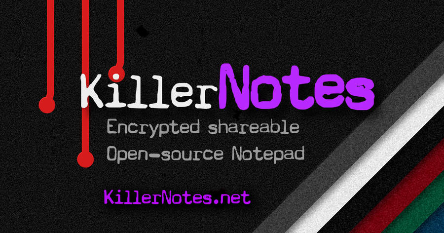
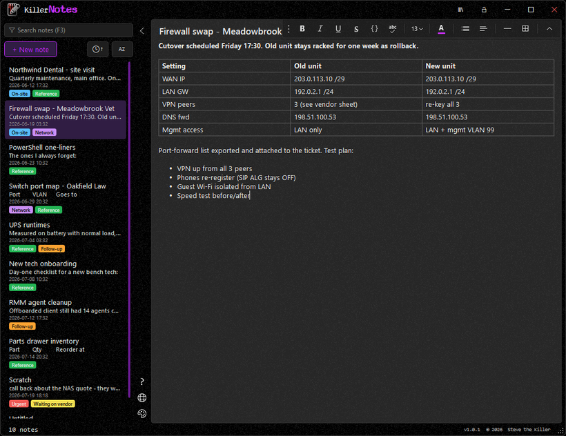
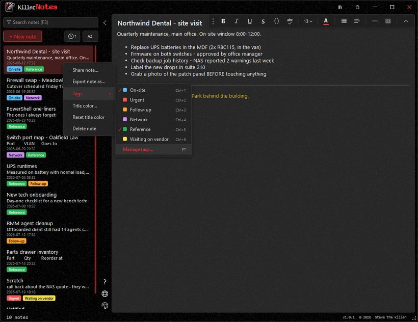
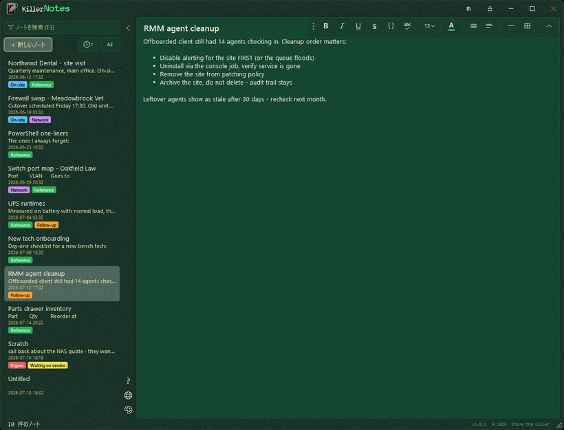
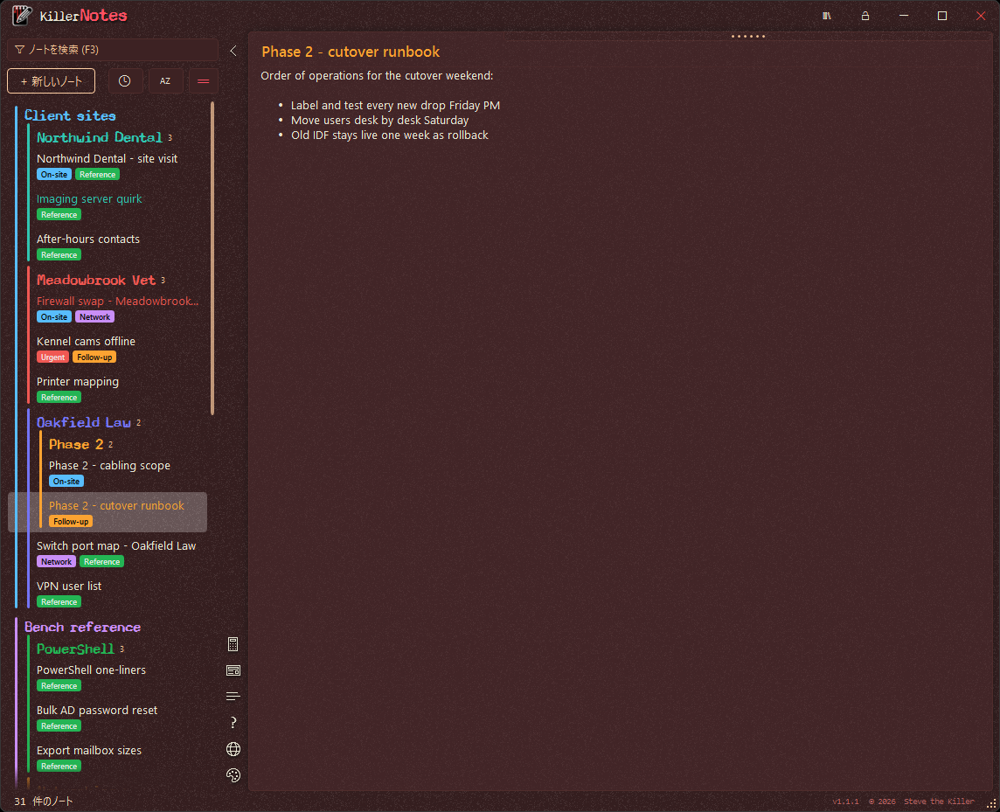

# KillerNotes

  

Notes that keep up. A searchable, organized replacement for the 80-tab Notepad workflow:
rich notes with inline images and tables, instant full-text search, and optional
password protection for the whole database.

Target: .NET Framework 4.8, x64, WPF. Builds on Windows (MSBuild/Visual Studio).

## Features

- Sidebar library: search-as-you-type across titles, text, and tags (SQLite FTS5); sort by
  time or title, or a drag-and-drop custom order (F10 cycles the modes). Three row densities
  (Ctrl+D) fit more notes on screen.
- Groups and subgroups: named, collapsible, colorable groups pinned above the loose notes,
  nested to any depth. A parent's color runs as a connector line down its notes and children,
  subgroups sit above the group's own notes (toggleable), and headers drag to reorder or
  re-nest. Travel inside shared .kndb files.
- Undo for the sidebar: Ctrl+Z reverts group moves, colors, tag toggles, note reorders, and
  note deletes, alongside the editor's normal text undo.
- Tags: color-coded per-database labels, assigned by right-click or Ctrl+1-9 and managed in
  the tags editor (F7). FTS-indexed, so tag search and the pill filter are free.
- Editor: rich text (bold / italic / lists / tables / rules), adjustable font size, a full
  text and highlight color picker with a desktop-wide eyedropper, and inline images. Per-note
  title color and spell check. Convert to list (Ctrl+Shift+J) for pasting into scripts, and
  pasted content is normalized to the current theme. Word wrap toggle (wide content reachable
  by horizontal scroll when off) and an optional line-number column (F11).
- Killculator (F9): a themed calculator that slides up under the notes list. Type an equation
  on the number keys; Print (Ctrl+Enter) drops the result into the note at the cursor.
- Autosave: after a pause in typing, on note switch, and on close (Ctrl+S forces it). Notes
  also remember their cursor and scroll position, so they reopen where you left off.
- Markdown/HTML preview: split-pane preview for notes that look like markdown or HTML (HTML
  is sanitized first).
- Keyboard: every function has a shortcut; F1 opens a shortcuts overlay with a full visual
  keyboard map. The whole app also scales for accessibility (Ctrl+Shift +/-).
- Storage: single SQLite database, configurable location (including next to the exe for a
  portable setup). Note bodies are XamlPackage blobs plus extracted plain text for search.
- Password protection: optional SQLCipher AES-256 encryption of the whole database, set /
  changed / removed at any time. No recovery for a lost password.
- Multiple databases: create, rename, switch, and relocate databases from the Manage
  databases dialog.
- Sharing: export a single note (.knote) or a whole database (.kndb), optionally password
  protected; both open with a double-click.
- Localization: nine bundled languages (English, Spanish, French, German, Turkish, Chinese
  Simplified and Traditional, Japanese, Bengali), falling back to English.

## Screenshots

<table>
<tr>
<td width="50%"> Notes with inline tables, tag pills, and search as you type.</td>
<td width="50%"> Color-coded tags, assigned from the right-click menu.</td>
</tr>
<tr>
<td> Six themes, each with its own accent colors.</td>
<td> Localized into nine languages.</td>
</tr>
</table>

## Dependencies

| Package | Why |
|---------|-----|
| Microsoft.Data.Sqlite.Core | ADO.NET SQLite wrapper (managed) |
| SQLitePCLRaw.provider.e_sqlcipher + lib.e_sqlcipher | SQLCipher native build: SQLite + FTS5 + AES-256 (static provider - the bundle's dynamic loader breaks under Costura) |
| Markdig | Markdown to HTML for the preview pane (managed, MIT) |
| PolySharp | net48 polyfills for modern C# syntax (compile-time only) |

Run `dotnet list package --vulnerable --include-transitive` as part of every release checklist.
Single-exe packaging: Costura.Fody embeds every managed dependency and a self-extracting
bootstrap carries the native e_sqlcipher.dll, so the release ships as one signed exe.

## Layout

- `MainWindow.xaml` + partials: `Notes.cs` (list/search/save), `Editor.cs` (paste/tables),
  `Groups.cs` (custom order + nested groups), `Killculator.cs` (sidebar calculator),
  `ActionUndo.cs` (sidebar Ctrl+Z), `Density.cs` (row density), `Security.cs` (password
  flow), plus the KillerUI kit files (`Chrome.cs`, `ThemeFlyout.cs`, `About.cs`, `Anim.cs`,
  `ConfirmDialog`, `PasswordDialog`, `InputDialog`).
- `Services/NoteStore.cs` - all SQL. `Services/ThemeManager.cs` - kit theme engine.
- `Themes/` + `Themes/Accents/` - the family palettes, copied from KillerScan.
