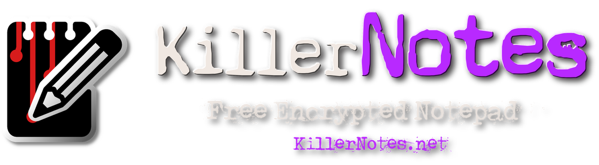
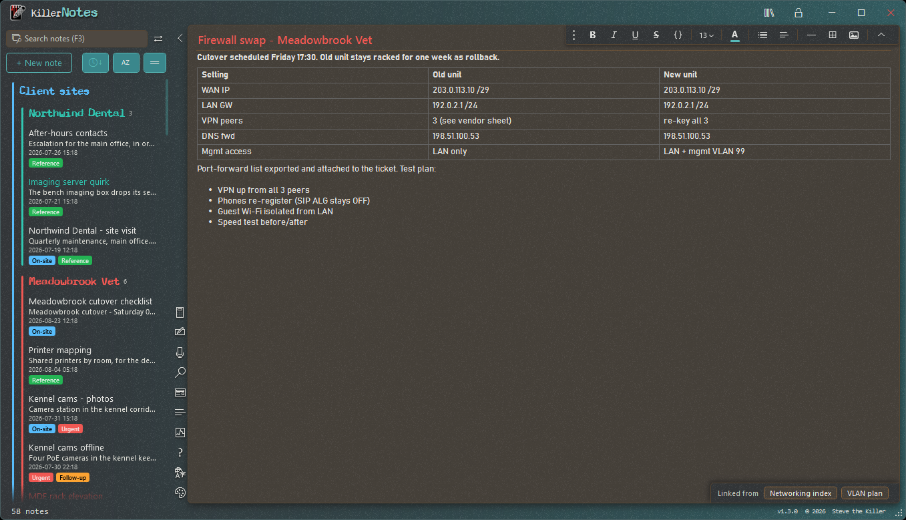
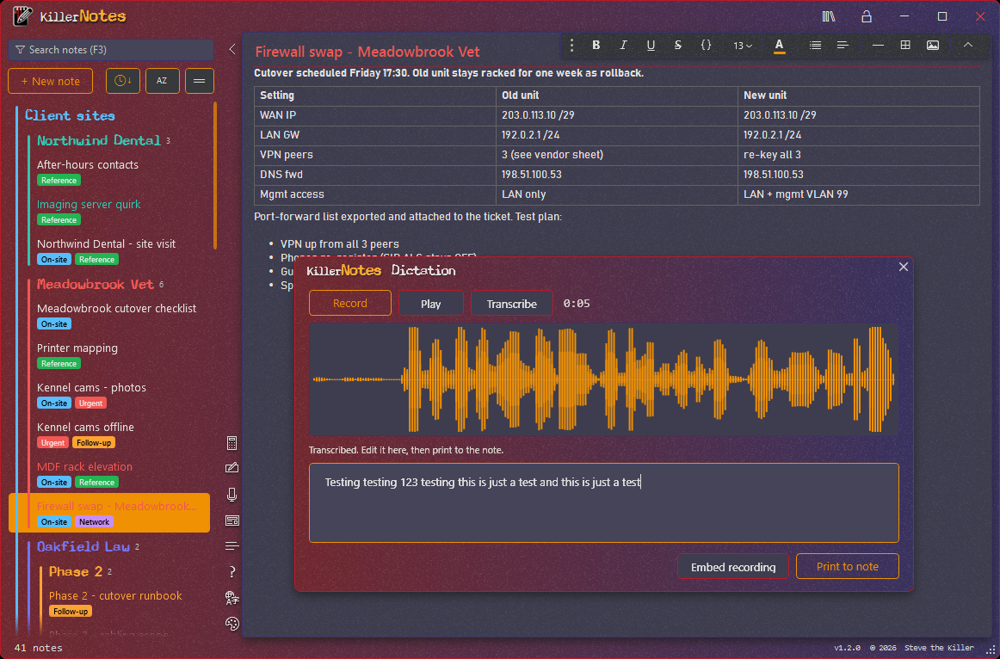
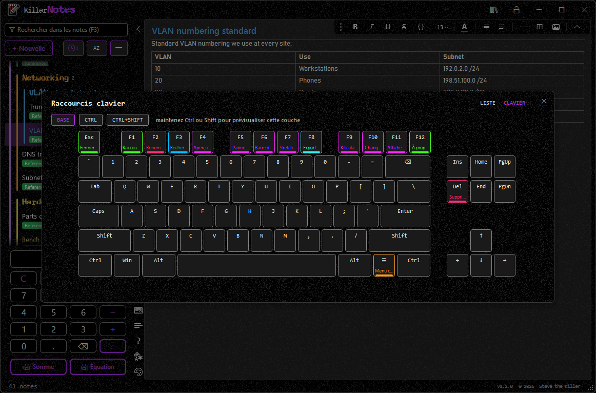
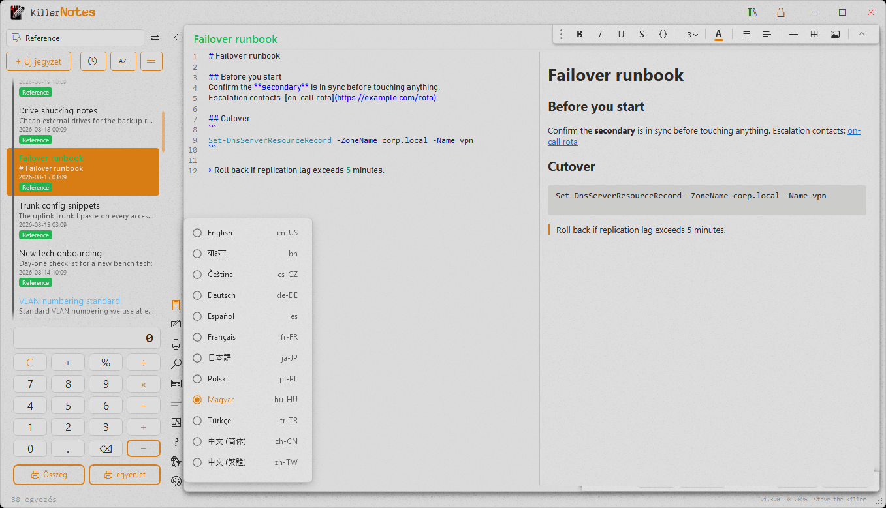

<p align="center">
  <a href="https://killernotes.net"></a>
</p>

Notes that keep up. A searchable, organized replacement for the 80-tab Notepad workflow:
rich notes with inline images and tables, instant full-text search, and optional
password protection for the whole database.

Target: .NET Framework 4.8, x64, WPF. Builds on Windows (MSBuild/Visual Studio).

## Features

- Find in the open note (`Ctrl+F`): a small card over the text with a match count, next/previous,
  and wrap at either end. Drag it anywhere by its grip and it reopens there. `F3`/`Shift+F3` step
  matches while it is open; matches are drawn over the text, so finding never touches the note,
  the undo stack, or autosave.
- Sidebar library: search-as-you-type across titles, text, and tags (substring match, so any fragment hits - `02` finds `A/002/45`); sort by
  time or title, or a drag-and-drop custom order (F10 cycles the modes). Three row densities
  (Ctrl+D) fit more notes on screen.
- Groups and subgroups: named, collapsible, colorable groups pinned above the loose notes,
  nested to any depth. A parent's color runs as a connector line down its notes and children,
  subgroups sit above the group's own notes (toggleable), and headers drag to reorder or
  re-nest. Travel inside shared .kndb files.
- Undo for the sidebar: Ctrl+Z reverts group moves, colors, tag toggles, note reorders, and
  note deletes, alongside the editor's normal text undo.
- Tags: color-coded per-database labels, assigned by right-click or Ctrl+1-9 and managed in
  the tags editor (Ctrl+T). FTS-indexed, so tag search and the pill filter are free.
- Editor: rich text (bold / italic / lists / tables / rules), adjustable font size, a full
  text and highlight color picker with a desktop-wide eyedropper, and inline images. Per-note
  title color and spell check. Convert to list (Ctrl+Shift+J) for pasting into scripts, and
  pasted content is normalized to the current theme. Word wrap toggle (wide content reachable
  by horizontal scroll, tilt wheel, or Shift+wheel when off) and an optional line-number
  column (F11).
- Hyperlinks: Ctrl+K links the selection (or edits the link under the caret), Ctrl+Click
  opens, typed URLs auto-link, and links survive pasting from browsers, Word, and other
  note apps. Only web and mail addresses ever open.
- Syntax highlighting: optional per-note, from the note right-click menu. Code is detected
  paragraph by paragraph, so one note can mix prose with PowerShell, HTML, XAML, XML, Vue,
  JSON, YAML, Markdown, SQL, C#, Python, JavaScript, TypeScript, CSS and Bash without
  picking a language. Plain text keeps the normal note color, and the token colors are
  never baked into the saved note.
- Themes: thirteen, each with its own accent set - Dark, Light, Black, Blood, Cyanotic,
  Greed, and the seven added in 1.2.0: 98SE, Ectoplasm, Decay, Mourning, Sepulchre,
  Delirium and Malaise. 98SE is a full Windows 98 reproduction, bevels and all.
- Killculator (F9): a themed calculator that slides up under the notes list. Type an equation
  on the number keys; Print Sum (Ctrl+Enter) drops the result, or Print Equation
  (Ctrl+Shift+Enter) the whole running equation, into the note at the cursor.
- Dictation (Ctrl+M): a modeless recording pad for the open note. Record from the microphone,
  and the take is transcribed as soon as you stop - print the text into the note at the
  caret, embed the recording itself as an inline chip, or both. Transcription runs on your
  machine with a downloadable speech model (three sizes, picked on first use, changeable by
  right-clicking the microphone on the rail); without one it falls back to Windows' own
  engine. Nothing is uploaded at any point.
- Recording editing and playback: the pad's waveform is the editing surface - right-click to
  slice, then copy, delete or paste segments, with undo, and save back over the original.
  Embedded recordings are a small transport rather than a button: the waveform fills as it
  plays, play becomes pause, and a volume knob sits at the end. Recordings are stored as
  FLAC (lossless, about half the size of WAV) and export to WAV or MP3, or copy as a file to
  paste into an email or chat.
- Free placement: drag an image or a recording and it lifts out of the text, snapping to a
  twelve-column grid and to the text's own lines, with the paragraph wrapping around it.
  Drop one on a table cell and it becomes that cell's content, widening the column to fit.
  There is no setting for this - dragging is the whole gesture.
- SketchPad (F7 / Ctrl+Shift+D): a modeless drawing companion for the open note - pen, line,
  arrow, rectangle, ellipse, polygon, paint bucket, text labels, and an eraser, with color,
  width, fill, and undo/redo, each on a single key. Print to note (Ctrl+Enter) stamps the
  drawing inline at the caret and it stays editable - double-click any note image to reopen it
  in the pad. A picture button on the format bar also inserts an image file at the caret.
- Custom fonts: a Fonts dialog (theme flyout) swaps the header, sidebar, and note-text fonts
  independently - any installed font, or drop your own .ttf/.otf onto the card. Note text
  ships in Bahnschrift; a readability guard keeps symbol fonts like Wingdings out.
- Autosave: after a pause in typing, on note switch, and on close (Ctrl+S forces it). Notes
  also remember their cursor and scroll position, so they reopen where you left off.
- Markdown/HTML preview: split-pane preview for notes that look like markdown or HTML (HTML
  is sanitized first).
- Keyboard: every function has a shortcut; F1 opens a shortcuts overlay with a full visual
  keyboard map. The whole app also scales for accessibility (Ctrl+Shift +/-).
- Storage: single SQLite database, configurable location (including next to the exe for a
  portable setup). Note bodies are XamlPackage blobs plus extracted plain text for search.
- Password protection: optional SQLCipher AES-256 encryption of the whole database, set /
  changed / removed at any time. No recovery for a lost password.
- Multiple databases: create, rename, switch, and relocate databases from the Manage
  databases dialog.
- Sharing: export a single note (.knote) or a whole database (.kndb), optionally password
  protected; both open with a double-click.
- Localization: ten bundled languages (English, Spanish, French, German, Turkish, Czech,
  Chinese Simplified and Traditional, Japanese, Bengali), falling back to English.

## Requirements

- Windows 10 or 11 (x64)
- No runtime install. Everything needed is inside the EXE (targets .NET Framework 4.8, which ships with every supported Windows release).

## Download

WinGet:

```powershell
winget install killernotes
```

- Prebuilt binary: <https://github.com/SteveTheKiller/KillerNotes/releases/latest/download/KillerNotes.exe>
- Source (GPL3 corresponding source for this release): <https://github.com/SteveTheKiller/KillerNotes/releases/latest>

## Screenshots

<table>
<tr>
<td width="50%"><br><sub>Nested groups, tag pills and search as you type - beside a note whose syntax highlighting is detected per paragraph, thirteen languages in one note.</sub></td>
<td width="50%"><br><sub>Dictation (Ctrl+M): record, scrub the waveform, transcribe offline, then embed the audio or print the text into the note.</sub></td>
</tr>
<tr>
<td><br><sub>Every function has a shortcut - F1 opens the visual keyboard map. Hold Ctrl or Shift to preview that layer. Shown in French.</sub></td>
<td><br><sub>Ten languages, translated down to the context menus - here Bengali, with a SketchPad drawing printed into the note.</sub></td>
</tr>
</table>

## Dependencies

| Package | Why |
|---------|-----|
| Microsoft.Data.Sqlite.Core | ADO.NET SQLite wrapper (managed) |
| SQLitePCLRaw.provider.e_sqlcipher + lib.e_sqlcipher | SQLCipher native build: SQLite + FTS5 + AES-256 (static provider - the bundle's dynamic loader breaks under Costura) |
| Markdig | Markdown to HTML for the preview pane (managed, MIT) |
| PolySharp | net48 polyfills for modern C# syntax (compile-time only) |
| libFLAC | Lossless storage for embedded recordings (native, BSD-3-Clause) |
| libmp3lame | MP3 export only, never storage (native, LGPL-2.1 - source shipped with every release) |
| whisper.cpp (+ ggml) | Offline speech recognition for dictation (native, MIT) |

The three audio natives are cross-compiled from their upstream release tarballs rather than
taken from a mirror; the tarballs, hashes and exact build commands are in
`third_party/audio/README.md`. Speech models are downloaded on demand from whisper.cpp's own
repository, not bundled. All of it is optional at build time - with `third_party/audio/`
empty the app still builds and runs, storing recordings as WAV and transcribing with the
Windows engine.

Run `dotnet list package --vulnerable --include-transitive` as part of every release checklist.
Single-exe packaging: Costura.Fody embeds every managed dependency and a self-extracting
bootstrap carries the native e_sqlcipher.dll, so the release ships as one signed exe.

## Layout

- `MainWindow.xaml` + partials: `Notes.cs` (list/search/save), `Editor.cs` (paste/tables),
  `Groups.cs` (custom order + nested groups), `Killculator.cs` (sidebar calculator),
  `SketchPadWindow.cs` / `SketchModel.cs` (SketchPad drawing companion),
  `Fonts.cs` (font slots + dialog), `Links.cs` (hyperlinks), `TiltWheel.cs` (horizontal
  scroll), `ActionUndo.cs` (sidebar Ctrl+Z), `Density.cs` (row density), `Security.cs` (password
  flow), plus the KillerUI kit files (`Chrome.cs`, `ThemeFlyout.cs`, `About.cs`, `Anim.cs`,
  `ConfirmDialog`, `PasswordDialog`, `InputDialog`).
- `Services/NoteStore.cs` - all SQL. `Services/ThemeManager.cs` - kit theme engine.
- `Themes/` + `Themes/Accents/` - the family palettes, the unified theme set shared across all the Killer apps.
