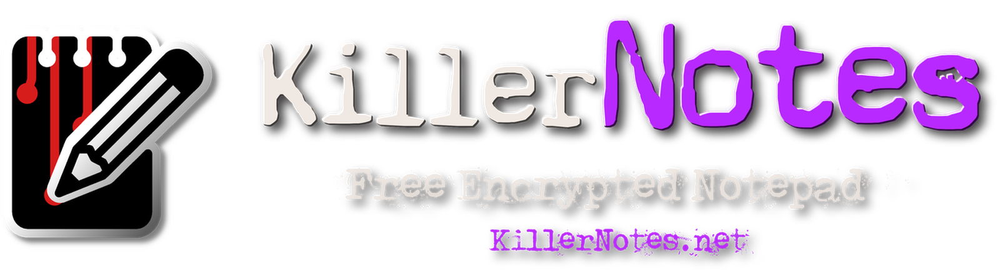
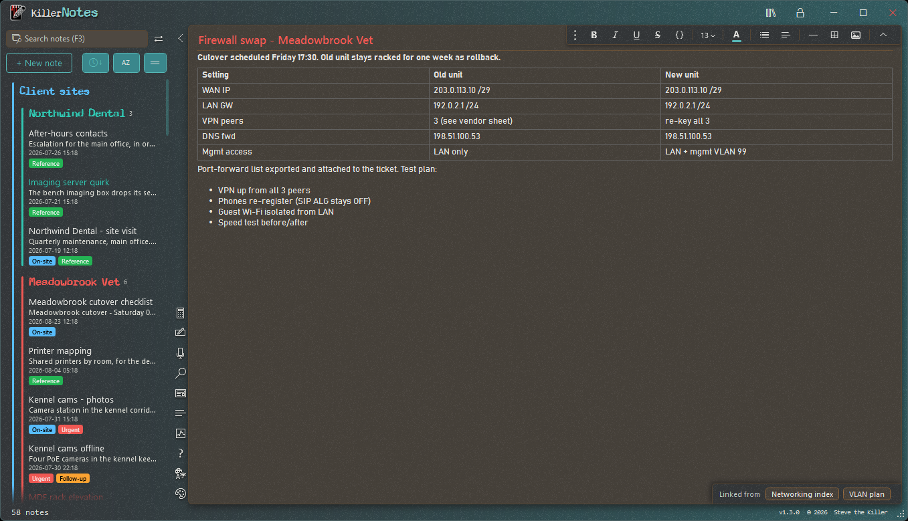
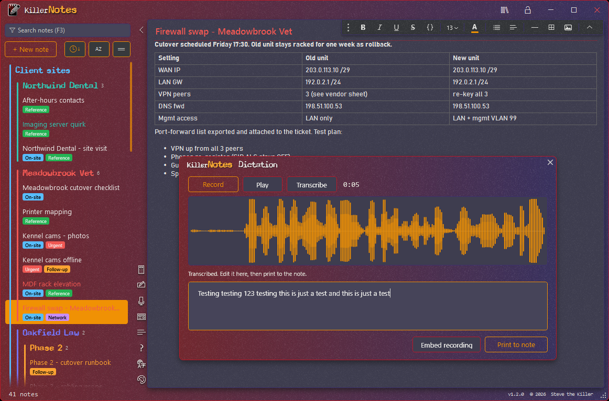
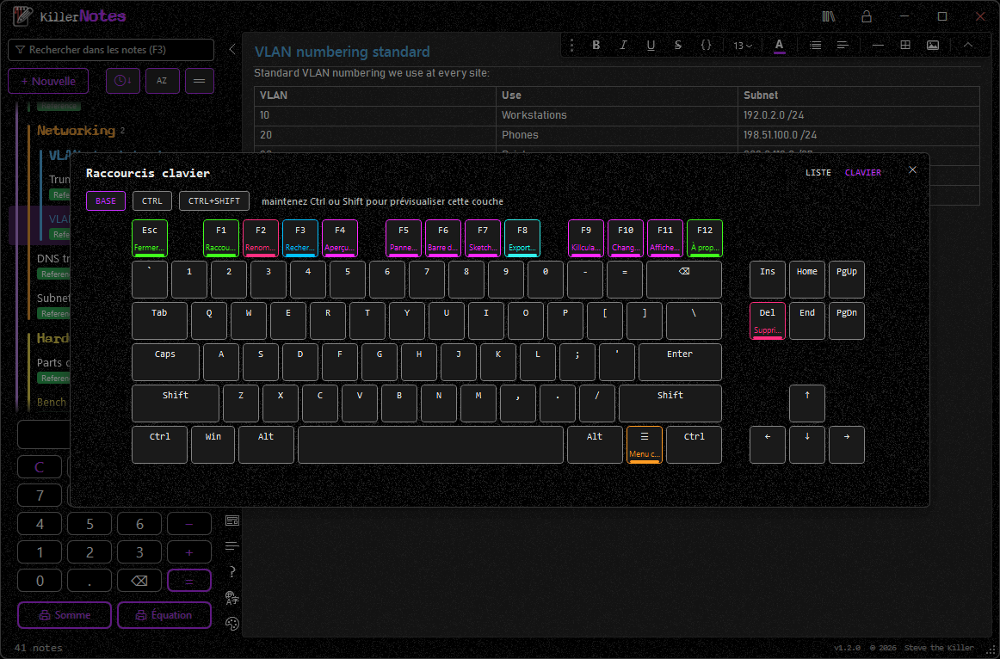
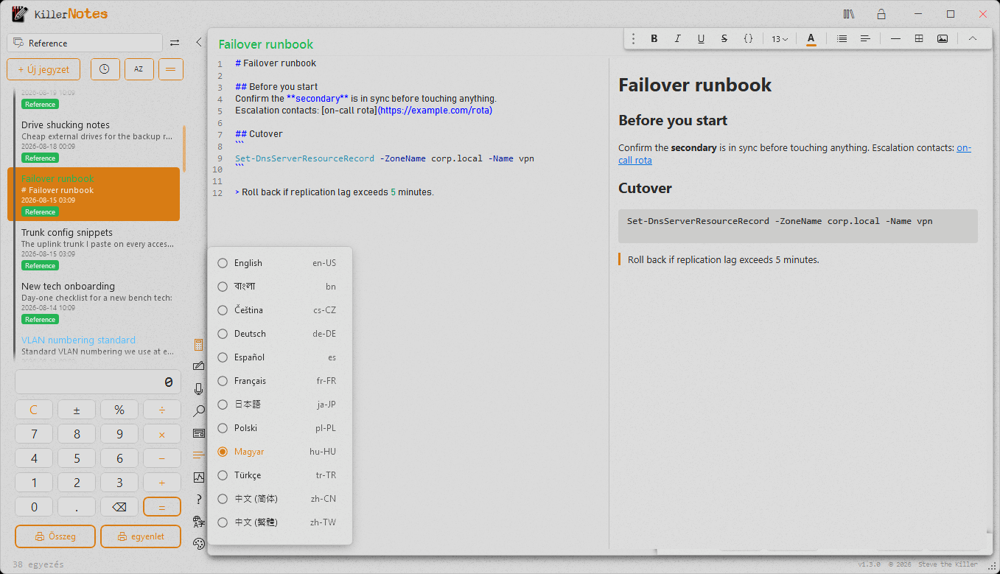

<p align="center">
  <a href="https://killernotes.net"></a>
</p>

Notes that keep up. A searchable, organized replacement for the 80-tab Notepad workflow:
rich notes with inline images and tables, instant full-text search, scheduled backups
with safe restore, and optional password protection for the whole database.

Target: .NET Framework 4.8, x64, WPF. Builds on Windows (MSBuild/Visual Studio).

See the [help page](https://killernotes.net/help.html) for workflows and shortcuts, and the [technical page](https://killernotes.net/technical.html) for storage, rendering, and security details.

## Features

- Rich text with images, tables, lists, checkboxes, spell check, custom fonts, title colors, and optional line numbers
- Search titles, text, and tags as you type; find and replace within a note or across notes
- Nested groups, colored tags, pinned notes, drag-and-drop ordering, templates, and daily notes
- Incoming and outgoing wikilinks, including links to notes that do not exist yet, plus a graph and heading outline
- Paragraph-level code highlighting and language-aware fenced Markdown code blocks
- Native Markdown and HTML preview with Source, Rendered, and adjustable Split views, following the active theme without a browser engine
- Autosave, saved cursor positions, version history, a 30-day trash, and scheduled backups that restore into a new database
- Multiple SQLite databases with optional SQLCipher AES-256 encryption; password-protected note (.knote) and database (.kndb) sharing
- Offline dictation (Ctrl+M) with downloadable speech models, waveform editing, inline audio, and WAV or MP3 export
- Editable inline drawings with SketchPad (F7), floating images and recordings, and the Killculator (F9)
- Keyboard access throughout, contextual menu hints, an F1 keyboard map, and whole-app accessibility scaling
- CLI support for search, editing, sharing, export, templates, groups, tags, recovery, and backups; run `KillerNotes --cli --help` for commands
- Nineteen languages and thirteen themes; eight accents on Dark, Light, Black, and 98SE give 41 looks

## Requirements

- Windows 10 or 11 (x64)
- No runtime install. Everything needed is inside the EXE (targets .NET Framework 4.8, which ships with every supported Windows release).

## Download

WinGet:

```powershell
winget install killernotes
```

Chocolatey:

```powershell
choco install killernotes
```

- Prebuilt binary: <https://github.com/SteveTheKiller/KillerNotes/releases/latest/download/KillerNotes.exe>
- Source (GPL3 corresponding source for this release): <https://github.com/SteveTheKiller/KillerNotes/releases/latest>

## Screenshots

<table>
<tr>
<td width="50%"><br><sub>Nested groups, tag pills and search as you type, beside a cutover note holding a real table. The Linked from strip lists every note pointing at this one.</sub></td>
<td width="50%"><br><sub>Dictation (Ctrl+M): record, scrub the waveform, slice out a segment, transcribe offline, then embed the audio or print the text into the note.</sub></td>
</tr>
<tr>
<td><br><sub>Every function has a shortcut - F1 opens the visual keyboard map. Hold Ctrl, Shift or Alt to preview that layer. Shown in French.</sub></td>
<td><br><sub>Live language switching, including context menus, beside a Markdown note and its preview.</sub></td>
</tr>
</table>

## Dependencies

| Package | Why |
|---------|-----|
| Microsoft.Data.Sqlite.Core | ADO.NET SQLite wrapper (managed) |
| SQLitePCLRaw.provider.e_sqlcipher | Managed P/Invoke shim to the SQLCipher native (static provider - the bundle's dynamic loader breaks under Costura) |
| SQLCipher + LibTomCrypt (vendored) | The encryption native itself, built from upstream source in `third_party/sqlcipher/` after the NuGet lib package line was deprecated |
| Markdig | Parses Markdown for native preview and rich text conversion (managed, MIT) |
| PolySharp | net48 polyfills for modern C# syntax (compile-time only) |
| libFLAC | Lossless storage for embedded recordings (native, BSD-3-Clause) |
| libmp3lame | MP3 export only, never storage (native, LGPL-2.1 - source shipped with every release) |
| whisper.cpp (+ ggml) | Offline speech recognition for dictation (native, MIT) |

The three audio natives are cross-compiled from their upstream release tarballs rather than
taken from a mirror; the tarballs, hashes and exact build commands are in
`third_party/audio/README.md`. Speech models are downloaded on demand from whisper.cpp's model
repository on Hugging Face, not bundled. All of it is optional at build time - with `third_party/audio/`
empty the app still builds and runs, storing recordings as WAV and transcribing with the
Windows engine.

Run `dotnet list package --vulnerable --include-transitive` as part of every release checklist.
Single-exe packaging: Costura.Fody embeds every managed dependency and a self-extracting
bootstrap carries the native e_sqlcipher.dll, so the release ships as one signed exe.
